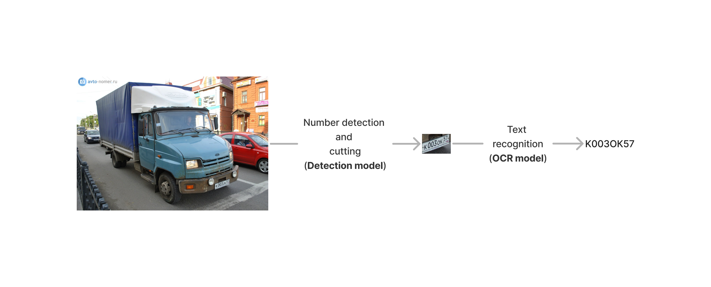

# Car number
**Detection of car numbers and their recognition**

# Dataset
1. [Kaggle - VKCV_2022_Contest_02](https://www.kaggle.com/competitions/vkcv2022-contest-02-carplates/data)
2. [Kaggle - Nomeroff Russian License plates](https://www.kaggle.com/datasets/evgrafovmaxim/nomeroff-russian-license-plates?select=autoriaNumberplateOcrRu-2021-09-01)
# Pipeline

# Results 
**Plate detector**
|Model|mAP 0.5|
|:------|:-------|
|YOLOv5|0.991|
|FasterRCNN|0.946|
|MTCNN|0.952|

**Plate recognition**
|Model|Accuracy|
|:------|:-------|
|EasyOCR(default)|0.003|
|EasyOCR(custom)|0.854|
|LPRNEt|0.751|

# Usage
**We tested three different detection models, three text recognition models and transform model.You can combine them however you like.
Be  careful with experiments, look at the results.\
First of all you need:**

pip install -r requirements.txt 

*Check tutorial.ipynb, file contains full guide.*

# Reference 
1. [MTCNN](https://arxiv.org/abs/1604.02878v1)
1. [LPRNet](https://arxiv.org/abs/1806.10447)
1. [Spatial Transformer Layer](https://arxiv.org/abs/1506.02025)
1. [LPRNet_Pytorch](https://github.com/sirius-ai/LPRNet_Pytorch)
1. [License Plate Detection Pytorch](https://github.com/xuexingyu24/License_Plate_Detection_Pytorch)
1. [YOLO V5](https://github.com/ultralytics/yolov5)
1. [Object Detection Metrics](https://github.com/rafaelpadilla/Object-Detection-Metrics)