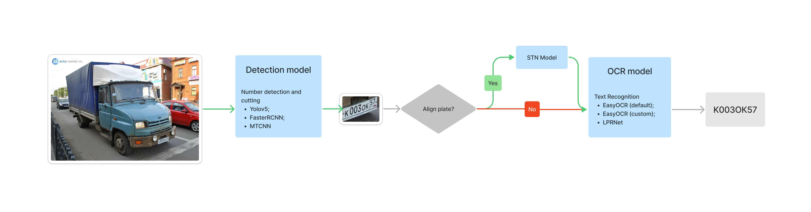

# Car number
**Detection of car numbers and their recognition**

# Dataset
1. [Kaggle - VKCV 2022 Contest_02](https://www.kaggle.com/competitions/vkcv2022-contest-02-carplates/data)
2. [Kaggle - Nomeroff Russian License plates](https://www.kaggle.com/datasets/evgrafovmaxim/nomeroff-russian-license-plates?select=autoriaNumberplateOcrRu-2021-09-01)
# Pipeline


# Project structure

Our solution consists of three main parts:
1. **Detector** - selection of a bounding box on a given image
2. **Transformation** - transformation of a dedicated car number in order to improve the accuracy of number recognition
3. **Plate recognition** - number recognition

There is a strict interface for each of the parts. Each part is independent of the other. The final pipeline consists of the sequential application of each part.

```
.
├── data
├── notebooks               <- Jupyter notebooks
├── README.md               <- The top-level README for developers using this project
├── requirements.txt        <- The requirements file for reproducing the analysis environment
├── result                  <- Empty folder for saving results
├── src
│   ├── configs             <- Folder that contains the parameters needed to run
│   ├── models              <- Folder that contains the description of the model
│   ├── predict
│   │   ├── backend.py      <- Carplates recognition pipeline
│   │   ├── detection.py    <- Implementations for number detection part
│   │   ├── ocr.py          <- Implementations for OCR part
│   │   └── transform.py    <- Implementations for transform part 
│   ├── utils
│   └── weights             <- Serialized models
└── tutorial.ipynb          <- Demonstration work
```

# Results 
## Metrics
**Plate detector**
|Model|mAP 0.5|
|:------|:-------|
|YOLOv5|0.991|
|FasterRCNN|0.946|
|MTCNN|0.952|

**Plate recognition**
|Model|Accuracy|
|:------|:-------|
|EasyOCR(default)|0.003|
|EasyOCR(custom)|0.854|
|LPRNEt|0.751|
## Performance 
Specifications:
* CPU: Intel i7-9750H (12) @ 2.600GHz 
* GPU: NVIDIA GeForce GTX 1660 Ti Mobile

**Plate detector**
| Detector | Processing time  of one image (s) |
|:--------:|-------------------------------|
| frcnn    | 0.136                         |
| mtcnn    | 0.096                         |
| yolo     | 0.027                         |


**Plate recognition**
|    Detector    | Processing time  of one image (s) |
|:--------------:|-------------------------------|
| easyocr        | 0.046                         |
| easyocr_custom | 0.027                         |
| lprnet         | 0.014                         |
| stnet+lprnet   | 0.015                         |

# Usage
We tested three different detection models, three text recognition models and transform model.You can combine them however you like. Be  careful with experiments, look at the results.


To demonstrate the results of the pipeline, you can use a [tutorial.ipynb](./tutorial.ipynb) Before using it, you need to install the project dependencies:
```
pip install -r requirements.txt 
```

After installing the dependencies, you need to be in the **root folder** of the repository run commands:
```
# Linux command
chmod +x load_data.sh
./load_data.sh
```

[**Link**](https://drive.google.com/drive/folders/175r-xavYr0N_iv7QhI7fAFiYw1e-qqAh?usp=sharing) to the directory with all weights that are used in this work.
# Reference 
1. [MTCNN](https://arxiv.org/abs/1604.02878v1)
1. [LPRNet](https://arxiv.org/abs/1806.10447)
1. [Spatial Transformer Layer](https://arxiv.org/abs/1506.02025)
1. [LPRNet Pytorch](https://github.com/sirius-ai/LPRNet_Pytorch)
1. [License Plate Detection Pytorch](https://github.com/xuexingyu24/License_Plate_Detection_Pytorch)
1. [YOLO V5](https://github.com/ultralytics/yolov5)
1. [Object Detection Metrics](https://github.com/rafaelpadilla/Object-Detection-Metrics)